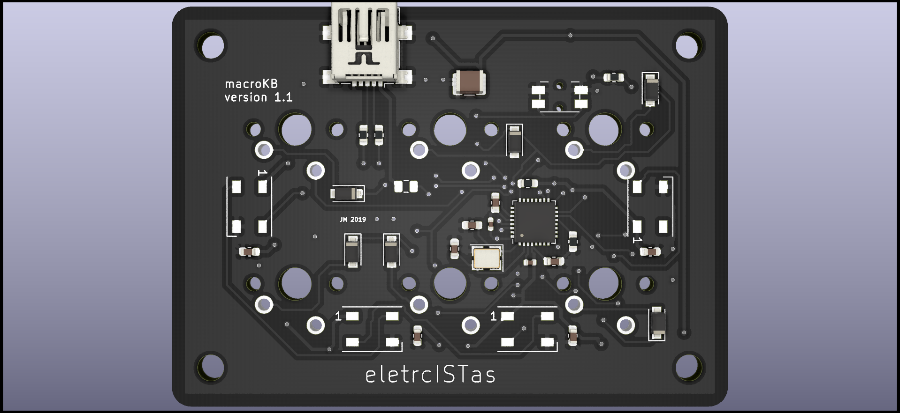

# 6macro
This is my first attempt at designing a keyboard. Is consists of a 6-key board intended for macros or as a dedicated controller for games with few bindings such as OSU.

RGB lighting is supported and the whole build is powered by an ATmega32U2 with the QMK firmware. The 6 switches are PCB-mounted.

The case is still a WIP and is built with stacked layers of laser-cut acrylic and a top layer of decorative aluminum.

